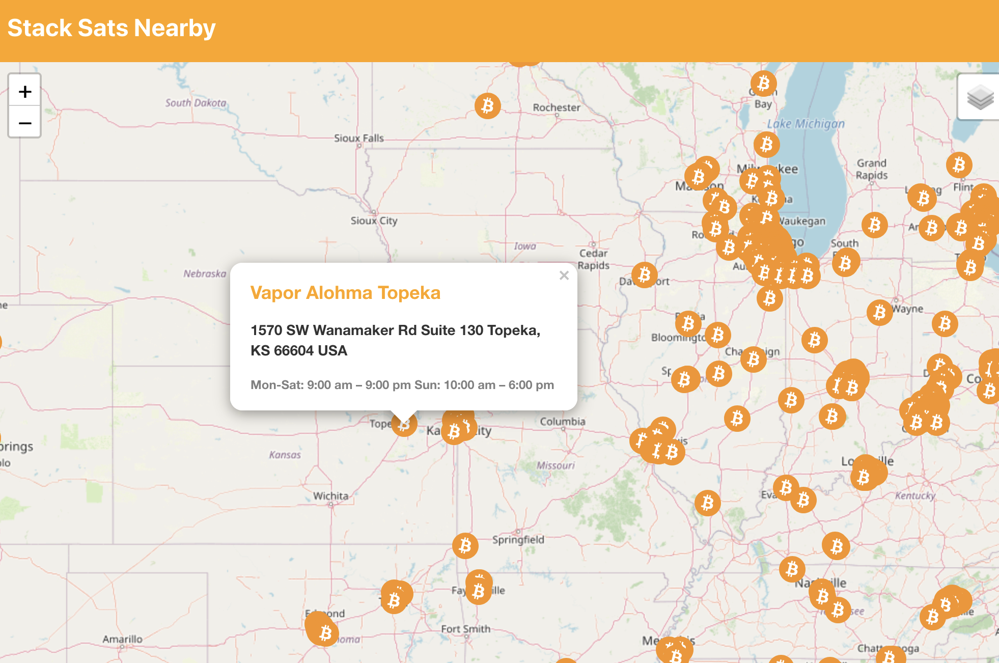

# stack-sats-nearby

Users can locate nearby Bitcoin ATMs and they can click on a Bitcoin icon to learn more about an ATM location

## Notes

_Original json data set can be found at [bitrawr-geojson](https://github.com/alonshvartsman/bitrawr-geojson)_
